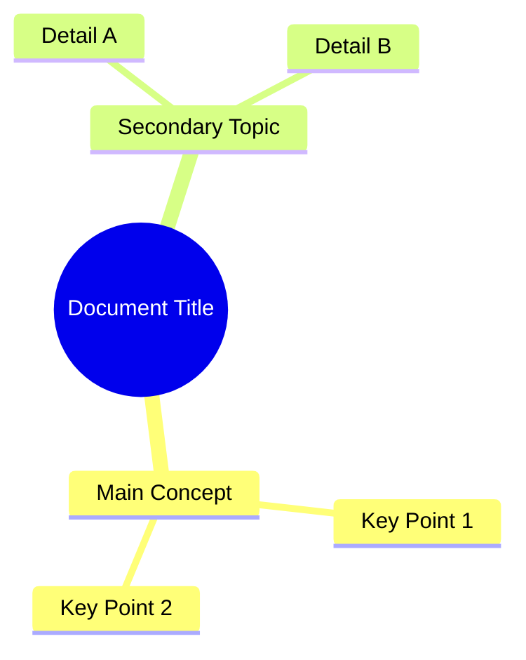

# DocPilot - AI-Powered PDF Assistant for VSCode

A comprehensive VSCode extension that combines advanced PDF viewing with intelligent AI summarization capabilities. View, navigate, and understand PDF documents through seamless Copilot Chat integration.

## ✨ Core Features

### 📄 Advanced PDF Viewing

- **Automatic Activation** - Opens PDFs seamlessly via File → Open menu
- **Local & Remote Support** - Open files from filesystem or URLs
- **Crisp Rendering** - High-quality display with PDF.js v5.3.93 engine
- **Smart Navigation** - Zoom, fit-to-width/page, continuous scrolling
- **Professional Toolbar** - Clean icon-based interface with intuitive controls
- **Text Selection** - Interactive text selection with dynamic visual feedback
- **Enhanced Object Extraction** - Extract text, images, tables, metadata, and 6 other object types
- **PDF Object Inspector** - Dual-mode hierarchical viewer for comprehensive document structure analysis
- **Screenshot Capture** - Drag-to-select screenshot tool with folder selection and save options
- **Debug Mode** - Developer tools for troubleshooting text layer rendering
- **VSCode Integration** - Seamless theme matching and responsive UI

### 🤖 AI-Powered Analysis

- **Intelligent Summarization** - Comprehensive document analysis via Copilot Chat
- **Mindmap Generation** - Create Mermaid mindmaps for visual document understanding
- **Multi-Model Support** - Works with GPT-4, Gemini, and other Copilot models
- **Smart Caching** - Instant results for previously processed documents
- **Semantic Chunking** - Advanced processing for documents of any size
- **Hierarchical Processing** - Multi-level summarization with context preservation
- **Progress Tracking** - Real-time status updates during analysis
- **Automatic Cache Invalidation** - Fresh summaries when files are modified

## 🚀 Installation

### Development Mode

1. Clone this repository
2. Open in VSCode
3. Install dependencies: `npm install`
4. Compile: `npm run compile`
5. Press `F5` to launch Extension Development Host
6. Test the extension in the new window

### From VSIX

- [VSCode Marketplace](https://marketplace.visualstudio.com/items?itemName=dteam-top.vscode-docpilot)
- [Open VSX](https://open-vsx.org/extension/dteam-top/vscode-docpilot)

## 📖 Usage

### Opening PDFs

**Automatic Activation (Easiest):**

- File → Open → Select any PDF file - DocPilot opens automatically!
- Double-click PDF files in VS Code Explorer

**Manual Commands:**

- Press `F1` → Type "DocPilot: Open Local PDF"
- Right-click any `.pdf` file in Explorer → "Open Local PDF"

**Remote URLs:**

- Press `F1` → Type "DocPilot: Open PDF from URL"
- Enter the PDF URL when prompted

### 🤖 AI Chat Integration

**Quick Start:**

1. Open Copilot Chat (`Ctrl+Alt+I` / `Cmd+Alt+I`)
2. Type `@docpilot /summarise [file-path-or-url]` for text analysis
3. Type `@docpilot /mindmap [file-path-or-url]` for visual mindmaps
4. Get comprehensive AI analysis with document viewer

**Supported Commands:**

```bash
@docpilot /summarise docs/report.pdf        # Local file + open viewer
@docpilot /summarise https://example.com/doc.pdf  # Remote URL + open viewer
@docpilot /summarise                        # File picker dialog + open viewer
@docpilot /mindmap docs/report.pdf          # Generate Mermaid mindmap from local file
@docpilot /mindmap https://example.com/doc.pdf    # Generate mindmap from remote URL
@docpilot /mindmap                          # File picker dialog + generate mindmap
@docpilot /cache-stats                      # View cache statistics
@docpilot /clear-cache                      # Clear all cached summaries
```

**Advanced Capabilities:**

- **🧠 Semantic Chunking** - Preserves context across document boundaries
- **⚡ Intelligent Caching** - Instant retrieval of previously processed summaries
- **🔄 Hierarchical Summarization** - Multi-stage analysis for comprehensive understanding
- **📊 Processing Analytics** - Detailed stats on chunks processed and pages analyzed
- **🛡️ Error Resilience** - Multiple fallback strategies ensure reliable operation
- **🔄 Auto Cache Invalidation** - File modification detection for fresh content

### Enhanced Toolbar Controls

**Navigation Controls:**

- **📄 Page Navigation**: First/Previous/Next/Last page buttons with SVG icons
- **📊 Page Counter**: Live page display showing current position
- **🔄 Page Input**: Direct page number input for quick navigation

**Zoom & Fit Controls:**

- **🔍 Zoom In/Out**: Precise zoom control with high-quality magnifying glass icons
- **📊 Zoom Level Display**: Current zoom percentage (25% - 300%)
- **📏 Zoom Slider**: Drag control for smooth zoom adjustment
- **📏 Fit Width**: Automatically fit PDF width to window for optimal reading
- **📄 Fit Page**: Fit entire page in window for complete overview

**Content & Analysis Tools:**

- **📝 AI Summarize**: Intelligent document analysis via Copilot Chat integration
- **🗺️ AI Mindmap**: Generate Mermaid mindmaps for visual document understanding
- **📤 Export Text**: Extract PDF content as clean text files with metadata
- **👁️ Text Selection**: Toggle interactive text selection with dynamic visual feedback
- **🔍 Text Search**: Vi-style text search across all pages with keyboard navigation
- **📷 Screenshot Tool**: Drag-to-select screenshot capture with folder selection and save options
- **🔍 PDF Object Inspector**: Dual-mode hierarchical viewer for comprehensive PDF structure analysis
- **🐛 Debug Mode**: Developer tools for troubleshooting text layer rendering

### 🗺️ AI Mindmap Generation

DocPilot now includes intelligent mindmap generation that transforms PDF documents into visual Mermaid mindmaps for enhanced understanding:

**Core Features:**

- **🧠 AI-Powered Analysis**: Uses advanced language models to extract key concepts and relationships
- **🎨 Mermaid Format**: Generates standard Mermaid mindmap syntax for universal compatibility
- **📄 Automatic File Creation**: Creates `.mmd` files and opens them directly in VSCode
- **🔄 Semantic Processing**: Analyzes document structure and creates hierarchical concept maps
- **⚡ Smart Caching**: Cached results for previously processed documents
- **🎯 Visual Understanding**: Transform complex documents into clear visual representations

**How to Use:**

1. **From Chat**: Open Copilot Chat and type `@docpilot /mindmap [file-path]`
2. **From Webview**: Click the mindmap button (🗺️) in the PDF viewer toolbar
3. **File Picker**: Use `@docpilot /mindmap` for file selection dialog

**Generated Output:**

- Creates a `.mmd` file with Mermaid mindmap syntax
- Automatically opens the file in VSCode for immediate viewing
- Compatible with Mermaid preview extensions
- Hierarchical structure showing document concepts and relationships

**Example Output:**



### 🔍 Text Search

DocPilot now includes powerful vi-style text search functionality for quick document navigation:

**Core Features:**

- **📄 Cross-Page Search**: Search across all pages in the PDF document
- **⌨️ Keyboard Navigation**: Enter for next match, Shift+Enter for previous, ESC to close
- **🔍 Case-Insensitive**: Finds matches regardless of letter case
- **⚡ Lazy Loading**: Text extracted on-demand for optimal performance
- **💾 Smart Caching**: Page text cached to avoid re-extraction
- **🎯 Visual Highlighting**: Current match highlighted with orange outline
- **📜 Auto-Scrolling**: Automatically scrolls to bring matches into view

**How to Use:**

1. Press `Ctrl+F` (or `Cmd+F` on Mac) or click the search button (🔍) in the toolbar
2. Type your search term (minimum 2 characters)
3. Use Enter/Shift+Enter or navigation buttons to move between matches
4. Press ESC to close search

**Vi-Style Experience:**

- Simple, distraction-free interface with no match counters
- Immediate search as you type with smart debouncing
- Seamless integration with existing PDF navigation

### 📷 Screenshot Capture

DocPilot includes a powerful screenshot tool that allows you to capture specific areas of PDF documents with professional workflows:

**Core Features:**

- **🖱️ Drag-to-Select**: Click and drag to select any rectangular area of the PDF
- **📁 Folder Selection**: Choose custom save locations with persistent folder memory
- **📋 Clipboard Support**: Copy screenshots directly to clipboard for immediate use
- **📄 Smart Naming**: Automatic timestamped filenames with page information
- **⌨️ Keyboard Controls**: ESC to cancel, intuitive modal interactions
- **🎯 Visual Feedback**: Live selection rectangle with smooth overlay transitions
- **📐 Minimum Size Validation**: Prevents accidental tiny selections

**How to Use:**

1. Click the screenshot button (📷) in the toolbar or press the shortcut
2. Click and drag to select the area you want to capture
3. Choose between "Save to File" or "Copy to Clipboard" in the modal
4. For file saving: select a folder using the browse button, then save
5. For clipboard: screenshot is immediately available for pasting

**Advanced Workflow:**

- **Folder Memory**: Once you select a save folder, it's remembered for the session
- **Smart File Naming**: Files saved as `screenshot-page-{N}-{YYYYMMDD}-{HHMMSS}.png`
- **High-DPI Support**: Automatically adjusts for Retina and high-resolution displays
- **Canvas-Based**: Captures actual PDF canvas content for perfect quality
- **Multi-Page Aware**: Handles complex layouts and page boundaries intelligently

### 🔍 PDF Object Inspector

The PDF Object Inspector transforms document analysis with a dual-mode hierarchical viewer that reveals the internal structure of PDF documents:

**Object-Centric Mode:**

- **🖼️ Images**: All images across the document with page references
- **📊 Tables**: Detected table structures with coordinate information
- **🔤 Fonts**: Used fonts with page distribution and properties
- **📝 Annotations**: Links, comments, and markup across pages
- **📋 Form Fields**: Interactive form elements and their properties
- **📎 Attachments**: Embedded files and document attachments
- **🔖 Bookmarks**: Hierarchical document outline and navigation
- **⚙️ JavaScript**: Document-level and page-level script actions
- **📑 Metadata**: Document properties, author, creation date, etc.

**Page-Centric Mode:**

- **📄 Page Analysis**: Objects organized by individual pages
- **Progressive Loading**: Batch processing for large documents (20 pages at a time)
- **Object Relationships**: Clear visualization of object distribution

**Advanced Features:**

- **Lazy Loading**: User-controlled scanning with "click to scan" interface
- **Progressive Display**: Real-time object discovery with batched results
- **Shared Cache**: Cross-mode efficiency with intelligent caching
- **Export Capabilities**: Image extraction, table CSV export, metadata JSON
- **VSCode Integration**: Full theme support and accessibility compliance

**Accessibility & UX:**

- **Full Accessibility**: All buttons include proper titles and ARIA attributes
- **Theme Integration**: Complete dark/light mode support with CSS filters
- **Keyboard Shortcuts**: `Ctrl/Cmd + F` to open search, `Ctrl/Cmd + +/-/0` for zoom, Enter/Shift+Enter for search navigation, ESC to close search
- **Mouse Controls**: `Ctrl + Scroll` for zoom, natural scrolling
- **Performance Awareness**: Automatic warnings and optimizations for large documents

## 🛠️ Development

### Project Structure

```text
vscode-docpilot/
├── src/
│   ├── extension.ts          # Main extension activation
│   ├── cache/                # Caching for summaries and documents
│   ├── chat/                 # Handles @docpilot chat interactions
│   ├── commands/             # VS Code command definitions
│   ├── editors/              # Custom editor for PDF files
│   ├── pdf/                  # Core PDF processing (text/object extraction)
│   ├── test/                 # Unit, integration, and e2e tests
│   ├── types/                # TypeScript interfaces and type definitions
│   ├── utils/                # Shared utilities (logger, errors, etc.)
│   └── webview/              # Frontend code for the PDF viewer
│       ├── assets/           # Icons and other static assets
│       ├── scripts/          # Client-side JavaScript for the webview
│       └── templates/        # HTML templates for the webview
├── package.json              # Extension manifest
├── tsconfig.json             # TypeScript configuration
└── README.md                 # This file
```

### Key Technologies

- **TypeScript** - Type-safe development with modern language features
- **PDF.js v5.3.93** - Mozilla's modern PDF rendering engine with ES modules
- **VSCode Extension API** - Deep IDE integration and Chat participant support
- **Language Model API** - Copilot integration for AI-powered analysis
- **HTML5 Canvas** - Hardware-accelerated PDF rendering

### Build Commands

```bash
# Install dependencies
npm install

# Compile TypeScript
npm run compile

# Watch mode for development
npm run watch

# Run tests
npm run test                # All tests (unit + integration)

# Run specific test suites
npm run test:unit           # Unit tests only (48 tests)
npm run test:integration    # Integration tests only (55 tests)
npm run test:e2e            # End-to-end tests with real VS Code

# Package extension (requires vsce)
vsce package
```

### Testing

The project includes comprehensive testing infrastructure with 100% success rate:

- **Unit Tests**
- **Integration Tests**
- **End-to-End Tests**
- **Enhanced Test Reporting**: Clear unit/integration separation with performance metrics
- **Test Utilities**: Helper functions for PDF operations and real webview communication
- **VS Code Integration**: Proper extension host testing environment

**End-to-End Testing:**

The project includes comprehensive E2E testing using **Playwright** for real browser automation with VS Code Extension Development Host:

- **Real VS Code Integration**: Tests run in actual VS Code Extension Development Host
- **Webview Testing**: Complete toolbar interaction testing within PDF viewer
- **User Workflow Simulation**: Realistic user interactions through command palette and UI
- **Visual Validation**: Button visibility, accessibility attributes, and user feedback testing
- **Feature-Specific Tests**: Dedicated E2E tests for object extraction, screenshot capture, and toolbar functionality

**Test Configuration:**

- `playwright.config.ts` - E2E test configuration with VS Code electron support
- `tsconfig.e2e.json` - TypeScript configuration for E2E tests
- `.env` support for environment variables in E2E tests

## 🎯 Architecture

### Unified PDF Viewing System

- **WebviewProvider**: Core PDF viewer with HTML generation and message handling
- **PDF Object Inspector**: Dual-mode hierarchical viewer for comprehensive document structure analysis
- **Custom Editor**: Automatic activation for File → Open, delegates to WebviewProvider
- **Commands**: Manual PDF opening via command palette and context menu
- **WebviewUtils**: Shared utilities for consistent panel creation across entry points

### Multiple Activation Methods

1. **Automatic**: File → Open on PDF files (via custom editor registration)
2. **Manual Commands**: `docpilot.openLocalPdf`, `docpilot.openPdfFromUrl`
3. **Context Menu**: Right-click on PDF files in Explorer
4. **Chat Integration**: `@docpilot /${slash-command}` command

### PDF Rendering

- Uses PDF.js for reliable cross-platform PDF parsing
- Canvas-based rendering for crisp quality at all zoom levels
- Optimized re-rendering for zoom operations

### VSCode Integration

- Custom editor provider for seamless file association
- Webview panels for PDF display with theme integration
- File system access for local PDFs and URL support

### Performance Optimizations

**Rendering:**

- Throttled zoom updates and parallel page rendering
- Efficient scroll event handling with viewport optimization

**AI Processing:**

- Token-aware chunking with configurable overlap (10% default)
- Batch processing (3 chunks concurrently) to prevent API overload
- Memory-efficient streaming with real-time progress updates
- Intelligent caching with file modification detection
- Persistent cache storage across VS Code sessions

## 🔧 Technical Highlights

**Intelligent Document Processing:**

- Automatic token estimation (3.5 chars/token) for accurate chunking
- Paragraph-aware semantic boundaries to preserve context
- Configurable overlap between chunks maintains narrative flow
- Multi-tier processing: single-chunk → semantic chunking → excerpt fallback

**Robust Error Handling:**

- Graceful degradation for oversized documents
- Comprehensive timeout management (30s for text extraction)
- Detailed error reporting with actionable feedback

## ⚠️ Limitations

- Initial load time increases with document size
- Very high zoom levels (>300%) may impact rendering performance
- AI summarization requires active Copilot subscription

## 🤝 Contributing

1. Fork the repository
2. Create a feature branch
3. Make your changes
4. Test thoroughly
5. Submit a pull request

## 📄 License

MIT License - see LICENSE file for details
