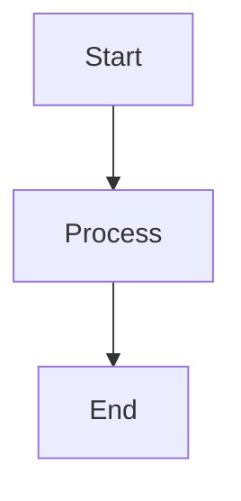

# DocPilot

VSCode extension for PDF viewing, AI-powered document analysis, and productivity tools.

## Features

### PDF Viewer

- **Automatic activation** when opening `.pdf` files via File → Open
- **Local and remote** PDFs (filesystem paths or URLs)
- **Navigation & zoom** controls with fit-to-width/page options
- **Text search** with keyboard navigation (Ctrl/Cmd+F)
- **Screenshot tool** with drag-to-select and clipboard support
- **Object inspector** for analyzing PDF structure (images, tables, fonts, annotations, metadata, etc.)
- **Theme integration** with VSCode dark/light modes

#### Screenshots


### AI Document Analysis

Requires active GitHub Copilot subscription.

- **Document summarization** with smart caching
- **Mindmap generation** in Mermaid format
- **Semantic chunking** for large documents
- **Multi-model support** (GPT-4, Gemini, etc.)
- **Cache management** (stats, export, clear)

#### Screenshots


### Quick Prompts

- **Customizable text processing** for selected text in any editor
- **Context menu integration** (right-click selected text)
- **Template system** with `{selectedText}` placeholder
- **Direct Copilot integration** for instant AI processing
- **Built-in defaults** (Explain Code, Find Issues)

#### Screenshots


### Markdown Enhancement

- **Automatic Mermaid rendering** in markdown preview
- **All diagram types** supported (flowcharts, sequence, class, state, ER, gantt, mindmap, etc.)
- **Theme-aware** visualization
- **Zero configuration** required

#### Screenshots


## Installation

**Marketplace:**

- [VSCode Marketplace](https://marketplace.visualstudio.com/items?itemName=dteam-top.vscode-docpilot)
- [Open VSX](https://open-vsx.org/extension/dteam-top/vscode-docpilot)

**Development:**

```bash
git clone https://github.com/DTeam-Top/vscode-docpilot
cd vscode-docpilot
npm install
npm run compile
# Press F5 in VSCode to launch Extension Development Host
```

## Quick Start

### Opening PDFs

```bash
# Automatic - just open a PDF file
File → Open → select.pdf

# Command palette
Ctrl/Cmd+Shift+P → "DocPilot: Open Local PDF"
Ctrl/Cmd+Shift+P → "DocPilot: Open PDF from URL"

# Context menu
Right-click .pdf in Explorer → "Open Local PDF"
```

### AI Commands

Open Copilot Chat (Ctrl/Cmd+Alt+I) and use:

```bash
@docpilot /summarise path/to/file.pdf
@docpilot /summarise https://example.com/doc.pdf
@docpilot /summarise                    # Shows file picker

@docpilot /mindmap path/to/file.pdf     # Generate Mermaid mindmap
@docpilot /cache-stats                  # View cache info
@docpilot /clear-cache                  # Clear all caches
@docpilot /cache-export                 # Export to markdown
```

### Quick Prompts

1. Select text in any editor
2. Right-click → DocPilot → Quick Prompts
3. Choose a prompt (or create custom ones in settings)

**Configure custom prompts:**

```json
{
  "docpilot.quickPrompts": [
    {
      "name": "Explain Code",
      "prompt": "Explain this code:\n\n{selectedText}"
    },
    {
      "name": "Find Bugs",
      "prompt": "Review for bugs:\n\n{selectedText}"
    }
  ]
}
```

### Mermaid Diagrams

Create markdown files with Mermaid code blocks:

````markdown
# My Document


```mermaid
flowchart TD
    A[Start] --> B[Process]
    B --> C[End]
```
````

Open preview (Ctrl/Cmd+Shift+V) to see rendered diagrams.

## Keyboard Shortcuts

**PDF Viewer:**

- `Ctrl/Cmd + F` - Search text
- `Enter` - Next search result
- `Shift + Enter` - Previous search result
- `ESC` - Close search
- `Ctrl/Cmd + +/-/0` - Zoom in/out/reset
- `Ctrl/Cmd + Scroll` - Zoom with mouse

## Configuration

Key settings (access via VSCode Settings):

```json
{
  "docpilot.textProcessing.chunkSizeRatio": 0.8,
  "docpilot.textProcessing.overlapRatio": 0.1,
  "docpilot.pdfViewer.maxCachedTextLayers": 10,
  "docpilot.timeouts.textExtractionMs": 30000
}
```

See full configuration options in VSCode Settings UI.

## Development

### Build Commands

```bash
npm run compile          # Build TypeScript + assets + bundle
npm run watch            # Watch mode for development
npm run bundle-webview   # Bundle webview scripts/styles

npm run test             # All tests
npm run test:unit        # Unit tests only
npm run test:integration # Integration tests only
npm run test:e2e         # End-to-end tests (Playwright)

npm run lint             # Lint with Biome
npm run format           # Format with Biome
npm run check            # Lint + format check

npm run package          # Create .vsix package
```

### Architecture

```
src/
├── extension.ts         # Entry point
├── chat/                # Copilot integration (@docpilot commands)
├── commands/            # VSCode commands (open PDF, quick prompts)
├── editors/             # Custom PDF editor provider
├── webview/             # PDF viewer frontend
│   ├── scripts/         # JavaScript modules (PDF.js integration)
│   ├── styles/          # CSS (theme-aware)
│   └── templates/       # HTML templates
├── pdf/                 # Text/object extraction, chunking
├── cache/               # Summary/document caching
├── markdown/            # Mermaid preview scripts
├── utils/               # Shared utilities
└── test/                # Unit/integration/E2E tests
```

**Key Technologies:**

- **TypeScript 5.9** - Strict mode with ES2020 target for type safety
- **PDF.js 5.3.93** - Mozilla's modern PDF rendering engine with ES modules
- **VSCode Extension API 1.102+** - Custom editor, webview panels, chat participant
- **Language Model API** - GitHub Copilot integration for AI features
- **Mermaid v11** - Diagram rendering loaded from CDN
- **Rollup** - Module bundling with esbuild minification for webview assets
- **Biome** - Fast linting and code formatting
- **Mocha + Chai + Sinon** - Unit and integration testing framework
- **Playwright** - End-to-end testing in real VSCode environment

## Limitations

- AI features require active GitHub Copilot subscription
- Initial load time scales with document size
- Very large documents (>100MB) may have performance issues

## License

MIT License - see [LICENSE](LICENSE) file for details.

## Links

- [Repository](https://github.com/DTeam-Top/vscode-docpilot)
- [Issues](https://github.com/DTeam-Top/vscode-docpilot/issues)
- [VSCode Marketplace](https://marketplace.visualstudio.com/items?itemName=dteam-top.vscode-docpilot)
