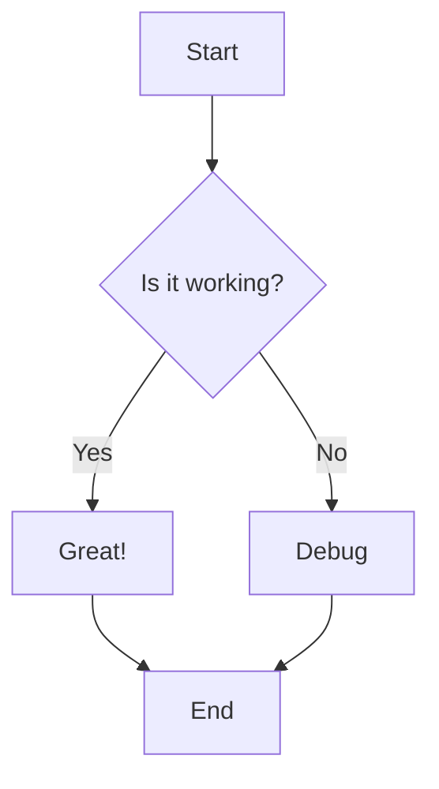

# Mermaid Diagram Examples

This file demonstrates DocPilot's automatic Mermaid diagram rendering in markdown preview mode.

## Markdown Code Block Format: Correct



## HTML Pre Block Format: Correct

<pre class="mermaid">
graph LR
    A[HTML Format] --> B[Also Supported]
    B --> C[Both Work!]
</pre>

## Instructions

To view the rendered diagrams:

1. Open this file in VSCode
2. Press `Ctrl+Shift+V` (Windows/Linux) or `Cmd+Shift+V` (Mac)
3. Diagrams will automatically render in the preview pane
4. The source code remains as text in the editor

## Markdown Code Block Format: Error

```mermaid
flowchart1 TD
    A[Start] -->  B{Is it working?}
    B -->|Yes| C[Great!]
    B -->|No| D[Debug]
    C --> E[End]
    D --> E
```

## HTML Pre Block Format: Error

<pre class="mermaid">
graph LR
    A[HTML Format] --> B[Also Supported]
    B --+> C[Both Work!]
</pre>
